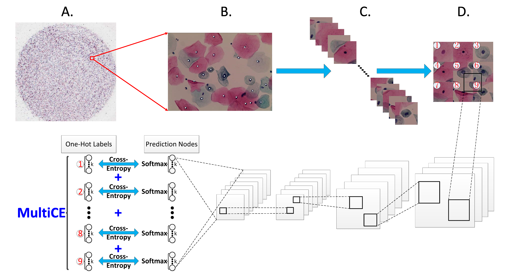
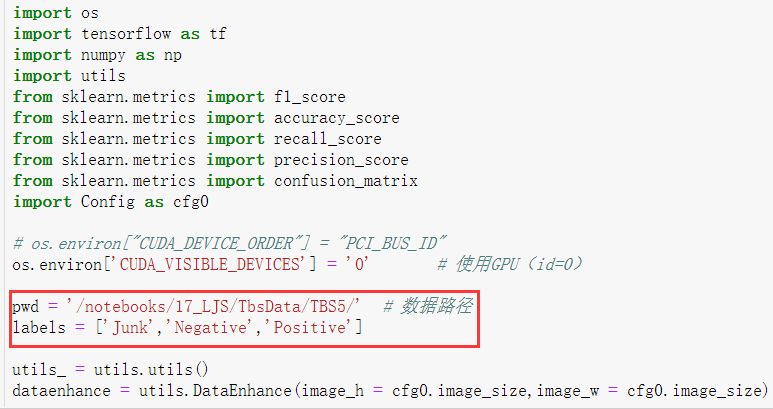
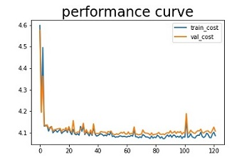
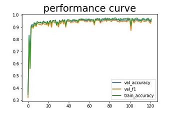

# IgrNet
A novel deep network named IgrNet, which can model the relationships of pathological features of cervical cells from the same specimen by a technology of intra-group reference.

###  **The framework of IgrNet:**

### **Usage:**

1. **Download:** git clone https://github.com/JiaShengLiu111/IgrNet.git

2. **Modify  configuration file [Config.py](https://github.com/JiaShengLiu111/IgrNet/blob/master/Config.py) according to your own needs;**

3. **Clear the folder <u>log</u>;**

4. **Modify the <u>run.ipynb</u>: change the dataset file path as follows:**

   

5. **Run the file of <u>[run.ipynb](<https://github.com/JiaShengLiu111/IgrNet/blob/master/run.ipynb>)</u> ;**

6. **View the experimental results as follows:**

 

